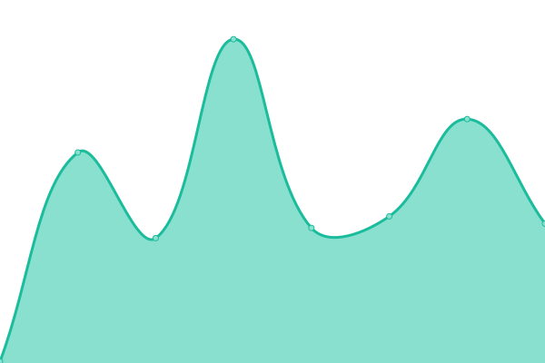

# [📈 Live Status](https://upptime.github.io/upptime): <!--live status--> **🟩 All systems operational**

This repository contains the open-source uptime monitor and status page for [Upptime](https://upptime.js.org), powered by [Upptime](https://github.com/upptime/upptime).

With [Upptime](https://upptime.js.org), you can get your own unlimited and free uptime monitor and status page, powered entirely by a GitHub repository. We use [Issues](https://github.com/upptime/upptime/issues) as incident reports, [Actions](https://github.com/upptime/upptime/actions) as uptime monitors, and [Pages](https://upptime.github.io/upptime) for the status page.

<!--start: status pages-->
<!-- This summary is generated by Upptime (https://github.com/upptime/upptime) -->
<!-- Do not edit this manually, your changes will be overwritten -->
<!-- prettier-ignore -->
| URL | Status | History | Response Time | Uptime |
| --- | ------ | ------- | ------------- | ------ |
|  [Iriss](https://www.iriss.org.uk) | 🟩 Up | [iriss.yml](https://github.com/irissorg/upptime/commits/HEAD/history/iriss.yml) | 

 722ms
     
 | 

<a href="https://irissorg.github.io/upptime/history/iriss">100.00%</a>
    

|  [Iriss Blogs](https://blogs.iriss.org.uk/rural-social-work-scotland) | 🟩 Up | [iriss-blogs.yml](https://github.com/irissorg/upptime/commits/HEAD/history/iriss-blogs.yml) | 

 1202ms
     
 | 

<a href="https://irissorg.github.io/upptime/history/iriss-blogs">100.00%</a>
    

|  [Iriss.fm](https://podcast.iriss.org.uk) | 🟩 Up | [iriss-fm.yml](https://github.com/irissorg/upptime/commits/HEAD/history/iriss-fm.yml) | 

 227ms
     
 | 

<a href="https://irissorg.github.io/upptime/history/iriss-fm">100.00%</a>
    

|  [Iriss.fm transcripts](https://transcripts.podcast.iriss.org.uk) | 🟩 Up | [iriss-fm-transcripts.yml](https://github.com/irissorg/upptime/commits/HEAD/history/iriss-fm-transcripts.yml) | 

 122ms
     
 | 

<a href="https://irissorg.github.io/upptime/history/iriss-fm-transcripts">100.00%</a>
    

|  [The Learning Exchange](https://lx.iriss.org.uk) | 🟩 Up | [the-learning-exchange.yml](https://github.com/irissorg/upptime/commits/HEAD/history/the-learning-exchange.yml) | 

 571ms
     
 | 

<a href="https://irissorg.github.io/upptime/history/the-learning-exchange">100.00%</a>
    

|  [Mindreel](https://mindreel.org.uk) | 🟩 Up | [mindreel.yml](https://github.com/irissorg/upptime/commits/HEAD/history/mindreel.yml) | 

 648ms
     
 | 

<a href="https://irissorg.github.io/upptime/history/mindreel">100.00%</a>
    

|  [Creative Covid Care](https://www.creativecovidcare.com) | 🟩 Up | [creative-covid-care.yml](https://github.com/irissorg/upptime/commits/HEAD/history/creative-covid-care.yml) | 

 1053ms
     
 | 

<a href="https://irissorg.github.io/upptime/history/creative-covid-care">100.00%</a>
    

|  [Research Unbound](https://www.researchunbound.org.uk) | 🟩 Up | [research-unbound.yml](https://github.com/irissorg/upptime/commits/HEAD/history/research-unbound.yml) | 

 914ms
     
 | 

<a href="https://irissorg.github.io/upptime/history/research-unbound">100.00%</a>
    

|  [Iriss Content](https://content.iriss.org.uk) | 🟩 Up | [iriss-content.yml](https://github.com/irissorg/upptime/commits/HEAD/history/iriss-content.yml) | 

 128ms
     
 | 

<a href="https://irissorg.github.io/upptime/history/iriss-content">100.00%</a>
    

|  [LGBT people and public services](https://www.lgbtgoodpractice.org.uk) | 🟩 Up | [lgbt-people-and-public-services.yml](https://github.com/irissorg/upptime/commits/HEAD/history/lgbt-people-and-public-services.yml) | 

 178ms
     
 | 

<a href="https://irissorg.github.io/upptime/history/lgbt-people-and-public-services">100.00%</a>
    

|  [NAPC](https://napc.scot) | 🟩 Up | [napc.yml](https://github.com/irissorg/upptime/commits/HEAD/history/napc.yml) | 

 1314ms
     
 | 

<a href="https://irissorg.github.io/upptime/history/napc">100.00%</a>
    

|  [TEC](https://tec.scot) | 🟩 Up | [tec.yml](https://github.com/irissorg/upptime/commits/HEAD/history/tec.yml) | 

 565ms
     
 | 

<a href="https://irissorg.github.io/upptime/history/tec">100.00%</a>
    

<!--end: status pages-->

[**Visit our status website →**](https://upptime.github.io/upptime)

## 📄 License

- Powered by: [Upptime](https://github.com/upptime/upptime)
- Code: [MIT](./LICENSE) © [Upptime](https://upptime.js.org)
- Data in the `./history` directory: [Open Database License](https://opendatacommons.org/licenses/odbl/1-0/)
